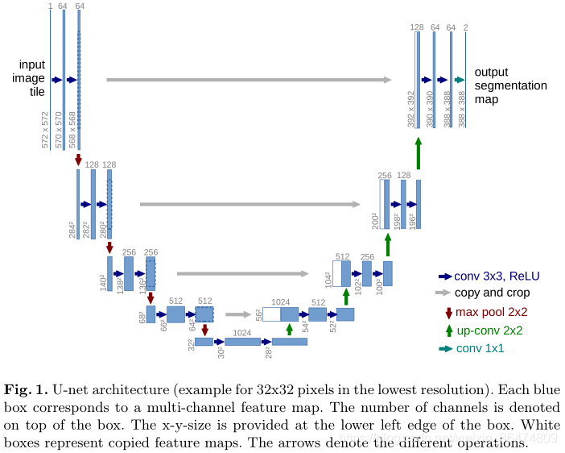
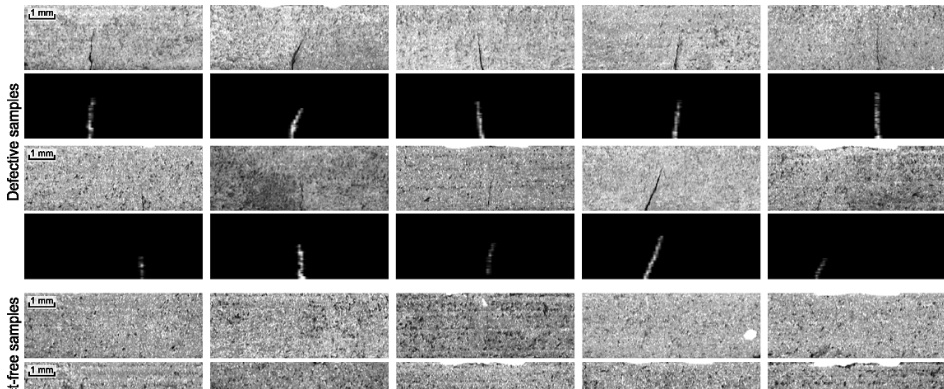

# Unet-Defect-Detection-in-kolektorSDD

My 2024 fall training project : Defect Detection in kolektorSDD with U_Net.

### Basic Information

I used Unet (and its family) to do the defect detection on the dataset kolektorSDD.

#### Unet

A U-shaped network with encoder-decoder structure. Here I combine it with the residual layer and attention gate.

#### kolektorSDD

The dataset is constructed from images of defected electrical commutators that were provided and annotated by Kolektor Group. Specifically, microscopic fractions or cracks were observed on the surface of the plastic embedding in electrical commutators. The surface area of each commutator was captured in eight non-overlapping images. The images were captured in a controlled environment.

The dataset consists of:

- 50 physical items (defected electrical commutators)
- 8 surfaces per item
- Altogether 399 images:
	-- 52 images of visible defect
	-- 347 images without any defect
- Original images of sizes:
	-- width: 500 px
	-- height: from 1240 to 1270 px
- For training and evaluation images should be resized to 512 x 1408 px

For each item the defect is only visible in at least one image, while two items have defects on two images, which means there were 52 images where the defects are visible. The remaining 347 images serve as negative examples with non-defective surfaces.

Official Link:https://www.vicos.si/Downloads/KolektorSDD

### My work

In the repo I wrote the code to train, evaluate and visualize the U_Net & its training effect. The demo used ResAttU_Net which behaves best in this task.

In the folder **‘data’** is the dataset;
In the folder **‘demo’** are the evaluated pictures;
In the folder **‘pic’** are pictures in this README;
In the folder **‘utils’** are codes used for dataloading, train and the models;
In the folder **‘log’** is the tensorboard log;

## References

[1] Ronneberger, O., Fischer, P., & Brox, T. (2015). U-Net: Convolutional Networks for Biomedical Image Segmentation. In *Medical Image Computing and Computer-Assisted Intervention – MICCAI 2015* (pp. 234-241). Springer, Cham. https://doi.org/10.1007/978-3-319-24574-4_28

[2] Zhang, Z., Liu, Q., & Wang, Y. (2018). Road Extraction by Deep Residual U-Net. *IEEE Geoscience and Remote Sensing Letters*, 15(5), 749-753. https://doi.org/10.1109/LGRS.2018.2802944

[3] Oktay, O., Schlemper, J., Le Folgoc, L., Lee, M., Heinrich, M., Misawa, K., Mori, K., McDonagh, S., Hammerla, N. Y., Kainz, B., Glocker, B., & Rueckert, D. (2018). Attention U-Net: Learning Where to Look for the Pancreas. *arXiv preprint arXiv:1804.03999*. https://doi.org/10.48550/arXiv.1804.03999

[4] https://github.com/Charmve/Surface-Defect-Detection

